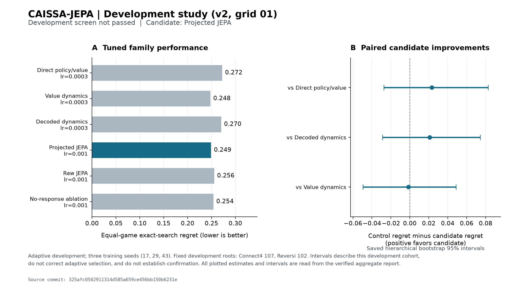
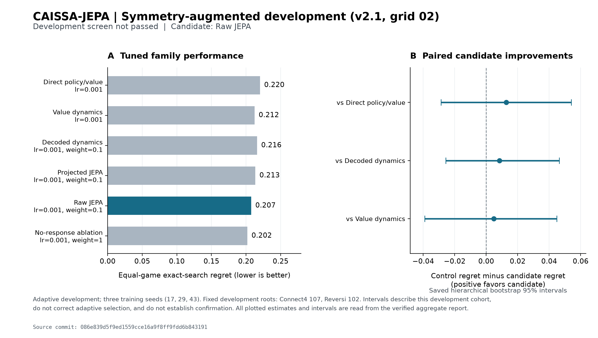
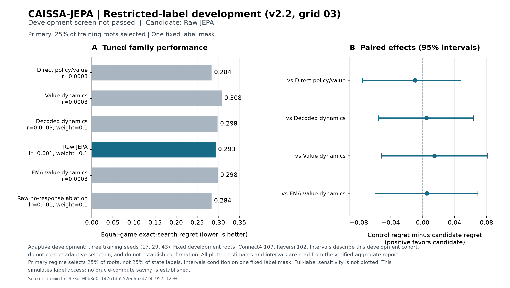
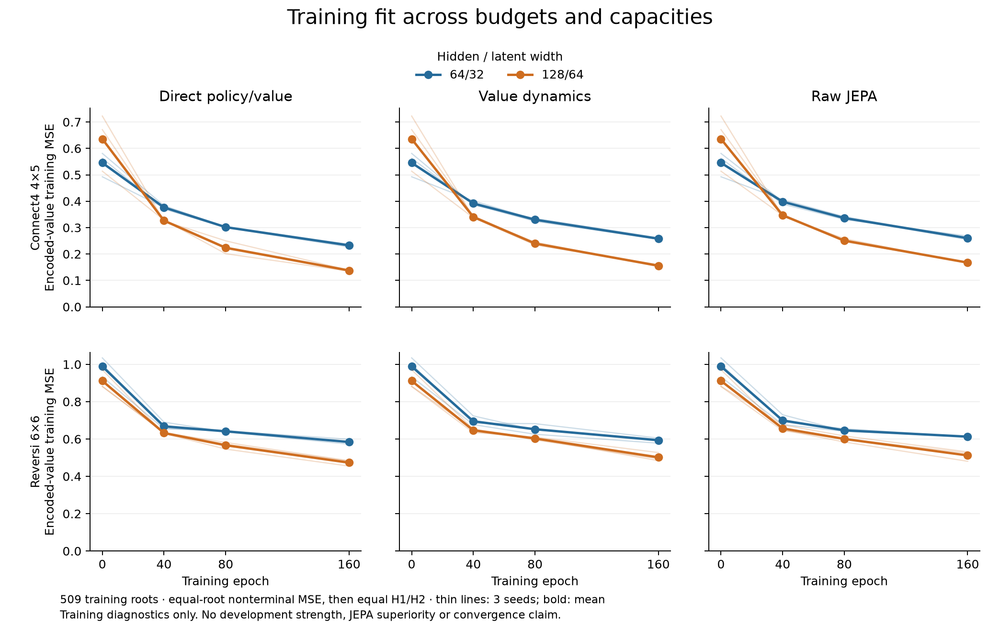
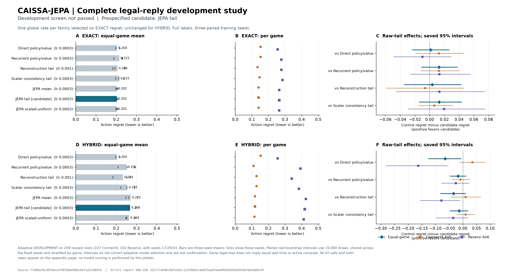

# CAISSA-JEPA: two-player JEPA research

The active research program tests action-conditioned latent prediction in
alternating, deterministic, fully observed, zero-sum games. Read
[Ground Truth](GROUND_TRUTH.md), [roadmap](ROADMAP.md), [frozen method](METHOD_SPEC.md)
and its [amendments](docs/METHOD_AMENDMENTS.md) first. The primary-source
[related-work matrix](docs/RELATED_WORK.md) identifies substantial novelty risk,
including MuZero, SPR/EfficientZero and RePAIR. No planning advantage or Q1
publication readiness has been established.

Latest status (2026-10-02): V2.8 completed an exploratory 60-fit, 160-block
development comparison on Connect4-6x7 and Reversi6. JEPA did not show an
observed advantage over task-value-dynamics (macro score contrast −0.01875;
unadjusted 95% seed-cluster interval [−0.08248, 0.04498]). The next V2.9 probe
is frozen and has a development-only train-split grant. Two preflights stopped
before fitting below the 2 GB RAM gate; a third resource-only fit then passed
four stable-memory checks and completed three epochs in 65.6 s with an 859 MB
peak working set. The supervised V2.9 panel then passed its own memory gate;
at 14:07 local it had completed 12/60 fits with no failures, while matches had
not started. These are progress/resource facts only, with no JEPA strength
result. Python 3.11.9 + pinned NumPy 2.4.6 is ready, and 20 V2.9 tests plus the
96-test V2.8 regression pass in that locked environment. The first sandboxed
start was denied, but noninteractive execution with the appropriate access
succeeded. The
resource-limited panel supervisor passed independent review. V2.9 changes only matched training
duration from one to three epochs. This tests an under-training explanation;
duration alone is not an algorithmic novelty claim. See [the V2.9 amendment](docs/V29_THREE_EPOCH_DEVELOPMENT_AMENDMENT_01.md),
[panel specification](docs/validation/V29_DEV_FIT_PANEL_V01.json), and
[current Ground Truth](GROUND_TRUTH.md). A positive development screen would
only nominate a separate model-selection study, not establish superiority or
Q1 readiness.

The current V2.8 planner candidate and its versioned amendments are documented in
`docs/METHOD_V28_PLANNER_V01.md` through `V05_AMENDMENT.md`. The frozen exact-root
regret estimand failed a 6x7 feasibility pilot (DEV10: zero of five complete
root-value maps within 500,000 nodes/two seconds). V05 therefore proposes paired
color-swapped whole-game score as the primary endpoint, with minimax regret only
as a secondary complete-root diagnostic. Its match/power protocol is V08; an
independent method review found no blocking statistical or schedule-integrity
issue. It remains pre-fit pending an implemented evaluator and measured
nonlearned runtime/variance/power gate.

The implementation audit found the first shared-model prototype did not match
frozen V01's KLENT policy/Q and alternating lambda-return objective. V01 is
preserved unchanged; the prototype is now separately versioned as the proposed
supervised V02 candidate in
[`docs/METHOD_V28_SUPERVISED_V02_AMENDMENT.md`](docs/METHOD_V28_SUPERVISED_V02_AMENDMENT.md).
V02 uses recorded behavior-action and terminal-outcome labels, with a
reply-set JEPA auxiliary loss and matched task-dynamics/direct-leaf controls.
An independent implementation/objective review found no P1 issue. V02's
development implementation was later trained and evaluated in V2.8 using
development-only authorization; no training-approved production manifest was
changed. The V2.8 comparison found no observed JEPA advantage over
task-value-dynamics. A separate V2.9 three-epoch duration probe is frozen but
not yet run. See
[`docs/V28_MODEL_V02_REVIEW_01.md`](docs/V28_MODEL_V02_REVIEW_01.md).

V2.8 data feasibility remains in development. DEV01–DEV08 are retained as
model-blind diagnostics; strict DEV09 passes only the prefit data audit, not
training approval or scientific power. DEV05's
support audit had an indentation defect. DEV06's reported support pass is
excluded from fitting because the code did not enforce the exact split tuple.
DEV07 stopped before output because valid Reversi play can contain more forced
passes than the former bound allowed. Strict DEV09 passed source regeneration,
component, family and support audits for Connect4 6x7 plus Reversi6; its full
receipt is `docs/validation/V28_DATA_SPLIT_DEV09.json`. This establishes only
prefit data feasibility. A separate development-only grant authorized V2.8
fits while `training_approved` remained false; these results remain
exploratory. Read
`docs/V28_DATA_POWER_PROTOCOL_V01.md` through `V07_AMENDMENT.md` and the
receipts. Read `docs/V28_MATCH_POWER_PROTOCOL_V08_AMENDMENT.md` for the proposed
paired-match design. The V2.8 exploratory paired-match and development fit are
complete, but they do not establish superiority. The locked schedule remains
unopened; independent confirmatory evidence, transfer, and Q1 readiness remain
open.

`two_player/` is the GUI-independent, shared-weight tiny-game research pipeline:
tic-tac-toe, gravity connect-3 and 4x4 Reversi; a 3x4 connect-3 size combination
is held out. Scope is middle/late local-position diagnostics, not whole-game
strength or unseen-family transfer. Seven controls include latent JEPA, recurrent
H1 inference, no-response, no-variance, direct policy/value, decoded dynamics and
value-only dynamics. The original whole-game data audit failed and is preserved.

Use Python 3.11.9 and `requirements-research-lock.txt` for the verified environment.
The following creates fresh ignored directories; existing paths are refused:

```powershell
$env:OPENBLAS_NUM_THREADS='1'
$env:OMP_NUM_THREADS='1'
python -B -m two_player.data chess_data/my-audit --games 200 --seed 1701 --scope middle-late
python -B -m two_player.train chess_data/my-audit chess_data/my-pilot
```

Training replays the data audit and rejects failure. Selection/final predictions
are excluded. Generated self-play is locally authorized project-owned data; its
public artifact license is unassigned, so datasets/checkpoints are not published.
See [source and license register](docs/DATA_SOURCES.md). No external corpus was
downloaded. The legacy chess confirmatory gate is unconditionally blocked pending
independent full-history rule validation; UCI evaluation is not such validation.

The [executed 21-run pilot](docs/TWO_PLAYER_PILOT_20260929.md) found no demonstrated
JEPA advantage: exact-state search hit a diagnostic ceiling; hybrid full JEPA
did not outperform direct or decoded controls. The next roadmap milestone is
benchmark redesign, not scaling this setup. See the
[working research note](docs/WORKING_PAPER.md) and
[independent review](docs/INDEPENDENT_REVIEW_20260929.md). Engineering verification:
87 unit tests, standalone core checks and 13 source-release smoke checks passed.

V2 is a separately frozen [recurrent reply-fork study](docs/METHOD_V2.md).
Its [prospective benchmark audit](docs/V2_SURVEY_RESULTS.md) passes for Connect4
4x5 and Reversi6, with independent bitboard labels and complete cross-split
context/target isolation. `two_player_v2/` uses a shared two-layer encoder and
recurrent dynamics with direct, value-dynamics, decoded, projected JEPA, raw JEPA
and no-response comparisons. This is development work; improvement is unproven.
The [36-run v2 grid](docs/V2_GRID01_RESULTS.md) completed without errors, but
JEPA did not beat the strongest tuned value-dynamics baseline (regret 0.249145
versus 0.247664). Development continues; selection/final predictions remain closed.
The [v2.1 amendment](docs/METHOD_V21.md) preserves that source and uses
`two_player_v21/` for coherent legal-symmetry augmentation and a finite auxiliary
weight grid. [Training-only diagnosis](docs/V2_GRID01_DIAGNOSIS.md) motivates the
change; it does not establish a positive outcome or a new objective.
Its [60-run result](docs/V21_GRID02_RESULTS.md) has a small raw-JEPA improvement
over value dynamics(0.004826 regret), but the interval crosses zero and the
predeclared promotion gates fail. [Independent review](docs/V21_INDEPENDENT_RESULTS_REVIEW.md)
replayed every sampling/augmentation plan and verified saved decisions. The
next [v2.2 label-access study](docs/METHOD_V22.md) completed all 72 runs.
Its [results](docs/V22_GRID03_RESULTS.md) also fail promotion: scarce-label raw
JEPA regret 0.293339 versus direct 0.283917. The full-label sensitivity arm cannot
replace the predeclared primary arm. All three development grids are preserved.
The [Vietnamese professor brief](docs/PROFESSOR_BRIEF_V2.md) separates completed
evidence from the still-unproven model and publication claims.

The [18-run training diagnostic](docs/V23_FIT_DIAGNOSTIC.md) then found that
longer training and larger capacity help all tested families. Direct fits the
training labels better than raw JEPA; no new strength comparison was made.
All72 snapshots passed [independent audit](docs/V23_INDEPENDENT_RESULTS_REVIEW.md).
The [next fixed-target order probe](docs/METHOD_V24_ORDER_PROBE.md) tests a
specific restriction of additive action conditioning before another model grid.
It cannot promote a JEPA candidate or establish novelty.

The [completed order probe](docs/V24_ORDER_RESULTS.md) failed its materiality
screen in every game/capacity group and passed independent artifact audit.
V2.4 reused the V2.3 checkpoints (hidden/latent 64/32 and 128/64); it did not
train or evaluate playing strength. Its largest median order-bound ratio was
0.002787 against a 0.10 materiality threshold.
The [V2.5 method](docs/METHOD_V25.md) therefore tests a separate hypothesis:
complete-reply mean/max latent consistency, compared with strong recurrent
policy/value, scalar, decoded and gradient-allocation controls. Its42-cell
development grid. The first attempt stopped inconclusive at cell4 because its
memory observer leaked retained ctypes types; the repaired 42-cell grid05 later
completed and was independently audited. It was **not promoted**: the candidate
raw-tail exact-state regret was 0.202446 versus 0.203775 for direct, while its
hybrid regret was worse (0.268340 versus 0.203775). See the
[full V2.5 result](docs/V25_GRID05_RESULTS.md) and
[runtime repair](docs/V25_RUNTIME_AMENDMENT.md).

## Tested model settings and development results

These studies use different data access, metrics, and evaluation protocols.
The table covers the active multi-game pilot and development series; the legacy
MARS-JEPA chess compatibility variants are listed separately below. Their
regret values must be read within each study; the figures do not form a
single cross-version leaderboard. `Exact regret` is lower-is-better action
regret on that study's development roots. V2.3 reports training fit only, and
V2.4 is a representation diagnostic rather than a strength comparison.

| Study | Model families and tested settings | Main result and interpretation |
| --- | --- | --- |
| [V1 / 21-run pilot](METHOD_SPEC.md) | Seven variants; shared 32-dimensional latent encoder; EMA 0.99; batch 64; Adam at 0.001; 10 epochs; seeds 17/29/43. | No demonstrated JEPA benefit. Exact-state regret hit a ceiling; hybrid full JEPA made some Reversi errors avoided by direct re-encoding. |
| [V2 / grid01](docs/METHOD_V2.md) | 6 families; shared encoder 198→64→32; recurrent hidden 64, latent 32, projection 16; batch 128; 40 epochs; learning rates 0.0003/0.001; seeds 17/29/43; 36 runs. | Selected projected-JEPA setting (lr 0.001) regret 0.249145 versus 0.247664 for value-dynamics. Not promoted. |
| [V2.1 / grid02](docs/METHOD_V21.md) | Same base dimensions; coherent legal-symmetry augmentation; 60 runs; rates 0.0003/0.001; predictive-arm auxiliary weights 0.1/1.0; 3 seeds; 40 epochs. | Raw JEPA (lr 0.001, weight 0.1) regret 0.207425; improvement over value-dynamics 0.004826 (95% interval −0.039003 to 0.044845). Promotion gates failed. |
| [V2.2 / grid03](docs/METHOD_V22.md) | Same base dimensions; 6 families, 2 rates (0.0003/0.001), 3 seeds; 25% selected training roots as the primary scarce-label arm, with a full-label sensitivity arm; 40 epochs; 72 runs. | Raw JEPA (lr 0.001, weight 0.1) scarce-label regret 0.293339 versus direct 0.283917. Not promoted. |
| [V2.3 / fit diagnostic](docs/METHOD_V23_DIAGNOSTIC.md) | Direct, value-dynamics, raw JEPA; hidden/latent widths 64/32 and 128/64; projection 16; learning rate 0.001; 160 epochs; 3 seeds; 18 runs. | Larger models and longer training improved training fit for all families. Direct had lower final fit error than raw JEPA at both capacities; no strength evaluation was run. |
| [V2.4 / order probe](docs/METHOD_V24_ORDER_PROBE.md) | Reused the 18 V2.3 checkpoints at both capacities; no new training. | Largest median order-bound ratio 0.002787, below the 0.10 materiality threshold. The proposed obstruction was not established. |
| [V2.5 / grid05](docs/METHOD_V25.md) | Seven families; encoder 198→128→64; transition hidden 50, latent 64, 65 actions; batch 32 complete-reply groups; auxiliary coefficient 0.1; 160 epochs; rates 0.0003/0.001; 3 seeds; 42 runs. | Raw-tail (selected lr 0.0003) exact regret 0.202446 versus direct 0.203775 (95% interval for improvement −0.023899 to 0.026938); hybrid regret was worse. Not promoted. |
| [V2.8 / supervised V02](docs/METHOD_V28_SUPERVISED_V02_AMENDMENT.md) | Development-only, 60 one-epoch fits; 20 matched seeds × reply-JEPA, task-value-dynamics, direct-leaf on audited DEV09. Shared two-ply max-min planner, 2 s / 500,000-transition caps. | 160 blocks / 320 games completed. JEPA−task-value macro −0.01875 (95% seed-cluster CI [−0.08248, 0.04498]); not evidence of advantage. See [analysis](docs/validation/V28_DEVELOPMENT_MATCH_ANALYSIS_V01.json). |
| [V2.9 / three-epoch probe](docs/V29_THREE_EPOCH_DEVELOPMENT_AMENDMENT_01.md) | Frozen duration ablation: 60 fresh fits (20 seeds × 3 arms), three epochs, then 160 paired blocks / 320 games. Only duration changes. | Development-only grant issued. One compute-only fit passed (65.6 s, 859 MB); supervised 60-fit panel in progress (12/60 completed at latest check), no matches yet. Automatic nomination gates are frozen; duration alone is not novelty or superiority. |

### Figures

Each figure reports only its named development study. V2.1 and V2.2 show
development regret and paired uncertainty; V2.3 shows training-label fit; V2.5
shows exact-state and hybrid planning results. Do not compare their plotted
values across figures as if they shared one protocol.







Read [adaptive research controls](docs/V2_RESEARCH_CONTROL.md) and the
[novelty-risk follow-up](docs/V2_FORK_GEOMETRY_NOVELTY.md) before interpreting it.

Use the verified CPython runtime (bare `python` may resolve to another Windows
installation). After the source/test gate passes, reproduce the new local study:

```powershell
$py='C:/Users/ANHKHOI/AppData/Local/Programs/Python/Python311/python.exe'
$env:OPENBLAS_NUM_THREADS='1'
$env:OMP_NUM_THREADS='1'
& $py -B -m benchmarks.survey chess_data/my-v2-survey --expanded --reversi6
& $py -B -m two_player_v2.data chess_data/my-v2-survey chess_data/two-player-pilot-v12 chess_data/my-v2-forks
& $py -B -m two_player_v2.runtime chess_data/my-v2-forks chess_data/my-v2-grid
& $py -B -m two_player_v2.report chess_data/my-v2-grid chess_data/my-v2-report
# Separate adaptive follow-up, after its source/test gate:
& $py -B -m two_player_v21.runtime chess_data/my-v2-forks chess_data/my-v21-grid
& $py -B -m two_player_v21.report chess_data/my-v21-grid chess_data/my-v21-report
# Restricted-label study: trainer receives only three standalone exports.
& $py -B -m two_player_v22.data chess_data/my-v2-forks chess_data/my-v22-scarce --fraction 0.25
& $py -B -m two_player_v22.data chess_data/my-v2-forks chess_data/my-v22-full --fraction 1
& $py -B -m two_player_v22.data chess_data/my-v2-forks chess_data/my-v22-development --development
& $py -B -m two_player_v22.runtime chess_data/my-v22-scarce chess_data/my-v22-full chess_data/my-v22-development chess_data/my-v22-grid
& $py -B -m two_player_v22.report chess_data/my-v22-grid chess_data/my-v22-report
# Training-only diagnostics; V24 requires the exact independently audited V23 inputs.
& $py -B -m two_player_v23_diagnostic.runtime chess_data/v22-full-01 chess_data/my-v23-fit
& $py -B -m two_player_v23_diagnostic.report chess_data/my-v23-fit chess_data/my-v23-report
& $py -B -m two_player_v24_probe.runtime chess_data/v23-fit-01 chess_data/v22-full-01 chess_data/my-v24-order
# Same frozen study with the audited constant-memory monitor amendment:
& $py -B -m two_player_v25r.runtime chess_data/v22-full-01 chess_data/v22-development-01 chess_data/my-v25-grid
& $py -B -m two_player_v25r.report chess_data/my-v25-grid chess_data/my-v25-report
```

The V24 probe accepts the pinned audited V23 ledger, not an arbitrary rerun with
different checkpoint bytes. It performs no training or development evaluation.

The prior v1.2 dataset is required to audit its training-state exclusion; use
the original v1 generation command above with its frozen seed and parameters.
All output paths must be fresh. The finite grid is serial and bounded; no paid
compute is used. An interrupted attempt with unaccounted elapsed compute cannot
be silently resumed inside the same grid budget.

## Legacy MARS-JEPA Chess compatibility implementation

**MARS-JEPA: Multi-Horizon Action-Conditioned Response-Aware State Prediction for Resource-Bounded Zero-Sum Chess**

MARS-JEPA Chess is a CPU/NumPy research prototype for deterministic, two-player,
zero-sum chess. The falsifiable hypothesis is that action-conditioned,
opponent-response-aware H1/H2/H4 latent prediction improves resource-bounded
chess planning over matched H1, H1/H2, and no-response controls.

This hypothesis has not been established. Representation quality, supervised
policy/value quality, and complete search strength must be measured separately.
There is no generic two-player-game transfer claim, demonstrated superiority
over Stockfish, Q1-readiness claim, or acceptance-probability estimate.

The legacy chess production dataset was intentionally removed because its integrity and
split validity were not trusted. No production training or valid model-v-model
result was created by the research-hardening task. Old receipts describe
historical runs and do not authorize using old data or checkpoints.

## Implemented model roster

| Research alias | Stable compatibility ID | Model |
| --- | --- | --- |
| `h1` | `a-jepa-h1` | H1 action-conditioned EMA JEPA; no reply exists within H1 |
| `h1-h2` | `a-jepa-h1-h2` | H1/H2 response-aware EMA JEPA |
| `full` | `a-jepa-v7` | H1/H2/H4 response-aware EMA JEPA |
| `no-response` | `a-jepa-no-response` | Matched allocated JEPA capacity with reply conditioning removed |
| `lejepa-inspired` | `lejepa-sigreg` | Shared-encoder SIGReg adaptation; no theoretical reproduction claim |
| `direct-policy-value` | `policy-value-v1` | Non-JEPA policy/value control |
| `nnue-style` | `nnue-style-v1` | Local NumPy evaluator, not Stockfish NNUE |

`model_registry.py` provides the shared GUI/CLI registry, configuration,
parameter-count and fingerprint metadata. Active and allocated capacity differ
for horizon ablations; this must be disclosed when matching compute budgets.

## Running and verifying

The legacy launchers remain `run_caissa_app.ps1`, `run_caissa_jepa_v7.ps1`,
`train_caissa_v7.py` and the installed CAISSA-JEPA executable. Python imports,
installer IDs, checkpoint filenames and CAISSA-JEPA storage paths are retained
for compatibility. This is a research-name migration, not a storage migration.
Application UI text is English.

```powershell
python -B -m unittest discover -v
git diff --check
```

Training requires explicit fresh/resume selection and matching verified data.
GUI Fresh mode archives existing weights after dataset verification; CLI fresh mode requires an unused path unless `--archive-existing` is explicit. An existing checkpoint is preserved and marked incompatible/unverified when
its dataset fingerprint cannot be verified. The former dataset-change override
is rejected. The test suite and release self-test use explicitly marked,
test-created temporary fixtures; they produce no research evidence.

An explicit offline audit command is available for a future separately acquired,
licensed dataset. It does not download data:

```powershell
python -B tools/audit_pipeline_dataset.py DATASET --research --report AUDIT_PLAN.json
python -B train_caissa_v7.py --dataset DATASET --split-plan AUDIT_PLAN.json --model-id full --model NEW_CHECKPOINT.npz
```

Do not run these against the intentionally removed production dataset. Audit
failures must be addressed in a separate derived version, preserving provenance.
The audit records excluded games/positions, source hashes, license metadata,
complete FEN checks, deterministic event splits, and position-overlap removal.

See [research identity](docs/RESEARCH_IDENTITY.md),
[research protocol](V7_RESEARCH_PROTOCOL.md), and
[hardening limitations](docs/MARS_HARDENING.md).
